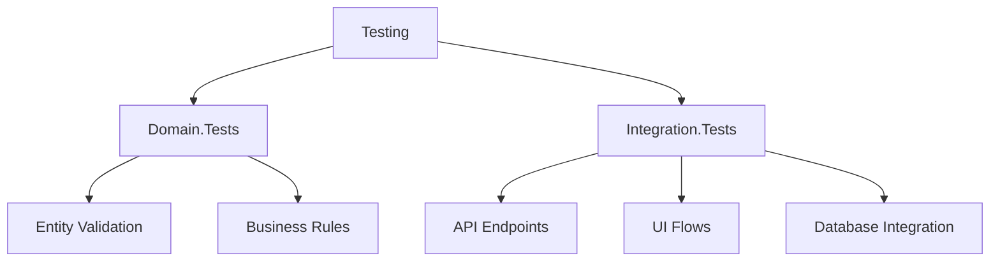

## 7. Phase 1 Implementation Patterns (Validated March 30, 2025)

### Domain Model Patterns
- **Rich Domain Models:** Implemented with encapsulated behavior and validation
- **Value Objects:** Used for immutable concepts (PlaylistSettings, WorkoutIntensity)
- **Domain Events:** Implemented for cross-cutting concerns (PlaylistItemReorderedEvent)
- **Factory Methods:** Used for complex object creation (PlaylistSettings.Create)
- **Validation Strategy:** Constructor-based validation with rich error messages

This document outlines the key architectural patterns, design decisions, and component relationships within the PulsePlaylist application.

## 1. System Architecture

- **Core Style:** Clean Architecture with Domain-Driven Design (DDD) principles. This emphasizes separation of concerns, testability, and placing business logic at the core, independent of infrastructure or UI.
- **Layering:** The system is structured into distinct layers/project groups:
  - **Domain:** Contains core business entities, value objects, domain events, and business rules. Independent of other layers.
  - **Application:** Orchestrates use cases, handles commands/queries (using MediatR), defines interfaces for infrastructure, contains DTOs and validation logic. Depends only on Domain.
  - **Infrastructure:** Implements interfaces defined in the Application layer. Handles data persistence (EF Core/PostgreSQL), external service integrations (Spotify, YouTube Music, Azure Blob Storage), caching (FusionCache/Redis), identity services, and logging (Serilog). Depends on Application and Domain.
  - **API:** Exposes application functionality via ASP.NET Core Minimal APIs. Handles requests, authentication, authorization, and responses. Depends on Application and Infrastructure (for DI setup).
  - **Presentation (Frontend):** Consists of multiple client applications:
    - `PulsePlaylist.Web`: Blazor Web App (Auto interactivity) for browser access.
    - `PulsePlaylist.Mobile`: .NET MAUI Blazor Hybrid app for iOS and Android (potentially desktop).
    - `PulsePlaylist.Shared`: Razor Class Library containing shared UI components (MudBlazor), models, and potentially client-side services used by both Web and Mobile.
- **Microservice (ML):** A distinct Python-based microservice (`PulsePlaylist.AdaptationEngine`) using FastAPI and PyTorch handles specialized machine learning tasks (predicting audio features based on intensity). It communicates with the main backend API via HTTP/REST.
- **Development Orchestration:** .NET Aspire is used via `PulsePlaylist.AppHost` and `PulsePlaylist.ServiceDefaults` to manage and configure the various services (API, Web, ML, Database, Cache) during local development and testing.

## 2. Key Technical Decisions

- **Unified .NET Stack (Mostly):** Leveraging .NET 9 across backend, web, and mobile (via MAUI Blazor) to maximize code reuse and leverage C# skills, with a deliberate exception for the Python ML service.
- **Cross-Platform UI Strategy:** Using Blazor for both web (`Blazor Web App`) and native clients (`MAUI Blazor Hybrid`), sharing UI components via a Razor Class Library (`PulsePlaylist.Shared`) and utilizing `MudBlazor` for a consistent Material Design look and feel.
- **Database Choice:** Standardizing on PostgreSQL for relational data, utilizing EF Core 9 as the ORM and integrating ASP.NET Core Identity directly within the same database but potentially managed via `IdentityDbContext` features within `ApplicationDbContext`.
- **Authentication Strategy:** Employing ASP.NET Core Identity for core user management, supporting cookie-based authentication (ideal for Blazor Web) and JWT (potentially for mobile client or inter-service communication if needed). OAuth integration for external providers (Google, Spotify).
- **API Style:** Adopting ASP.NET Core Minimal APIs for concise and performant endpoint definition, using an Endpoint Registrar pattern for organization.
- **ML Implementation:** Decoupling the ML component as a separate Python/FastAPI/PyTorch microservice, allowing independent development and scaling, accessed via REST from the .NET backend.
- **API Documentation:** Using Microsoft.OpenApi for OpenAPI/Swagger documentation generation and UI.
- **Caching Strategy:** Implementing a multi-layered caching approach using FusionCache, potentially backed by both memory and Redis for distributed caching.
- **API Client Generation:** Using Kiota to generate type-safe HTTP clients for frontend applications, ensuring consistency with the API contract.
- **File Storage:** Utilizing Azure Blob Storage for scalable object storage needs.

## 3. Design Patterns in Use

- **Architectural:** Clean Architecture, Microservices (for ML component).
- **Domain-Driven Design (DDD):** Entities, Value Objects, Domain Events, Aggregate Roots (implied), Repositories, Unit of Work (via `DbContext.SaveChangesAsync` and potentially an explicit UoW interface).
- **Application Layer:** Command Query Responsibility Segregation (CQRS) via `MediatR`, DTO (Data Transfer Object), Validation (FluentValidation), Pipeline Pattern (`MediatR` Pipeline Behaviors for caching, validation, logging).
- **API Layer:** Minimal API Endpoint Registration Pattern, Middleware (ASP.NET Core), Dependency Injection (ASP.NET Core built-in).
- **Data Access:** Repository Pattern, Unit of Work Pattern, Persistence Interceptors (EF Core Interceptors), Specification Pattern (potentially used within repositories for complex queries).
- **UI (Blazor/MAUI):** Component-Based Architecture, MVVM (Model-View-ViewModel, commonly used with Blazor), State Management Patterns (Service-based, potentially dedicated libraries like Fluxor if needed), Progressive Web Application (PWA).
- **Creational:** Dependency Injection.
- **Behavioral:** Mediator, Strategy (implied in adaptation logic), Event Sourcing (via Domain Events).
- **Structural:** Adapter (potentially for external service clients), Facade (potentially for simplifying Application service interactions).

## 4. Component Relationships

- **Frontend (`Web`, `Mobile`) -> API (`API`):** Clients use Kiota-generated HTTP clients to make REST calls to the API for data and operations. Authentication is handled via Cookies (Web) or potentially JWT/Tokens (Mobile). SignalR is likely used for real-time updates _from_ the API _to_ the clients.
- **API (`API`) -> Application Layer (`Application`):** API endpoints receive requests, map them to Commands/Queries, and send them via `MediatR` to the appropriate Handlers in the Application layer. Responses are mapped back from domain/result objects to DTOs.
- **Application Layer (`Application`) -> Domain Layer (`Domain`):** Handlers load/use Domain Entities and Value Objects, execute domain logic, and may raise Domain Events.
- **Application Layer (`Application`) -> Infrastructure Layer (`Infrastructure`):** Handlers use Repository _Interfaces_ and other service _Interfaces_ defined in the Application layer. They commit changes via the Unit of Work pattern (often wrapping `DbContext.SaveChangesAsync`).
- **Infrastructure Layer (`Infrastructure`) -> External Systems:** Implements interfaces by interacting with:
  - **PostgreSQL Database:** Via EF Core 9 (`ApplicationDbContext`).
  - **External APIs:** Spotify, YouTube Music (via dedicated HTTP clients).
  - **File Storage:** Azure Blob Storage.
  - **Cache:** FusionCache provider (Memory/Redis).
  - **Identity:** ASP.NET Core Identity services interacting with the Identity schema in PostgreSQL.
- **API (`API`) / Backend Services -> ML Service (`AdaptationEngine`):** The API (likely via a service in the Infrastructure layer) makes HTTP requests to the FastAPI endpoints of the Python ML microservice to get audio feature predictions.
- **Mobile (`Mobile`) -> Native Platforms:** The MAUI Blazor Hybrid app interacts with iOS (HealthKit) and Android (Health Connect) native APIs via platform-specific code or abstractions for health data access.
- **.NET Aspire (`AppHost`, `ServiceDefaults`):** Orchestrates the running and configuration of `API`, `Web`, `ML Service` (as a container), `PostgreSQL` (as a container), and `Redis` (as a container) during development. Provides service discovery and centralized configuration/defaults.
- **Shared Library (`Shared`):** Contains Razor components (MudBlazor based), DTOs (potentially), and client-side logic/services used by both `PulsePlaylist.Web` and `PulsePlaylist.Mobile`.
- **Identity & Domain Integration:** ASP.NET Core Identity entities are likely stored within the same PostgreSQL database as domain entities (managed by `ApplicationDbContext` which extends `IdentityDbContext` links to my ApplicationUser), allowing for transactions that span both, possibly linked via User IDs.

## 5. Test Architecture



This structure promotes modularity, testability, and scalability, allowing different parts of the system to evolve independently while adhering to defined contracts and interfaces.

## 6. Architectural Decisions

### Database Strategy

#### Development vs Production
- **Context**: Need for efficient local development while maintaining production-grade database support
- **Decision**: Use SQLite for development/testing and PostgreSQL for production
- **Implementation**:
  1. Database-agnostic entity configurations
  2. Provider-specific migrations in separate projects
  3. Environment-specific DbContext configurations

#### Migration Strategy
- **Project Structure**: 
  ```
    src/Migrators/
  ├── Migrators.MSSQL/
  ├── Migrators.PostgreSQL/
  └── Migrators.SQLite/
  tests/PulsePlaylist.Domain.Tests/
  ├── Entities/
  │   ├── PlaylistTests.cs
  │   ├── PlaylistItemTests.cs
  │   ├── TrackTests.cs
  │   ├── AudioFeaturesTests.cs
  │   └── WorkoutSessionTests.cs
  └── ValueObjects/
      ├── PlaylistSettingsTests.cs
      └── WorkoutIntensityTests.cs
  ```
- **API Project Integration**: Migrations projects referenced in `PulsePlaylist.Api.csproj`
- **Naming Convention**: `{Purpose}_{DatabaseType}`
  ```powershell
  # Example:
  ConfigureEntityRelationships_SQLite
  ConfigureEntityRelationships_PostgreSQL
  ```

#### Configuration Approach
- **Core Configurations**: Database-agnostic properties
  ```csharp
  builder.Property(x => x.Id)
      .HasMaxLength(36)
      .IsRequired();
  ```
- **Provider-Specific Overrides**: Handled in Migrator projects
  ```csharp
  // SQLite
  property.SetColumnType("TEXT");

  // PostgreSQL
  property.SetColumnType("uuid")
         .SetDefaultValueSql("uuid_generate_v7()");
  ```

### Identity Implementation Strategy


#### ApplicationUser Location Decision
- **Context**: ApplicationUser class inherits from IdentityUser (ASP.NET Core Identity)
- **Decision**: Place ApplicationUser in Infrastructure layer despite having domain properties
- **Rationale**:
  1. Maintains Clean Architecture principles while acknowledging practical framework needs
  2. Prevents Domain layer from taking framework dependencies
  3. Enables seamless integration with ASP.NET Core Identity features
  4. Simplifies authentication and user management workflows

#### Implementation Guidelines
- Domain layer remains framework-independent
- Business logic stays in Domain services
- Application layer handles mapping between Domain.User and Infrastructure.ApplicationUser
- Identity-related services are confined to Infrastructure layer
- Clear documentation maintains architectural clarity

### ID Type Strategy

#### Current Implementation
- **Context**: Entity IDs within the system (Track, Playlist, WorkoutSession)
- **Pattern**: Using string IDs with GUID format
  ```csharp
  public virtual string Id { get; set; } = Guid.CreateVersion7().ToString();

#### Migration Generation
- **Development (SQLite)**:
  ```powershell
  cd src/Migrators/Migrators.SQLite
  dotnet ef migrations add ConfigureEntityRelationships_SQLite --context SqliteDbContext -o Migrations/SQLite
  ```
- **Production (PostgreSQL)**:
  ```powershell
  cd src/Migrators/Migrators.PostgreSQL
  dotnet ef migrations add ConfigureEntityRelationships_PostgreSQL --context PostgresDbContext -o Migrations/PostgreSQL
  ```
- **Database Configuration**:
  - MaxLength(36) for all ID fields
  - Text/UUID type determined by database provider
  - Consistent foreign key constraints
- **Rationale**: 
  1. Compatibility with ASP.NET Core Identity's string-based IDs
  2. Flexibility in ID representation while maintaining GUID uniqueness
  3. Easier integration with external services that may use string IDs
  4. Simpler serialization/deserialization in APIs
  5. Database provider independence

  - **Test Coverage Types:**
  1. Constructor Validation Tests
  2. Business Rule Tests
  3. Value Object Behavior Tests
  4. Domain Event Tests
  5. Edge Case Tests
  6. Floating-Point Comparison Tests

### Validated Design Decisions
1. **ID Strategy:** String-based GUIDs for compatibility with ASP.NET Core Identity
2. **Encapsulation:** Private setters with public methods for state changes
3. **Collection Handling:** Private collections with public readonly access
4. **Domain Events:** Raised from within domain entities
5. **Floating-Point Precision:** Handled via appropriate test assertions
6. **JSON Serialization:** Implemented for complex value objects

### Clean Architecture Enforcement
- Domain layer has no external dependencies
- Entities contain business logic and validation
- Value objects ensure immutability
- Domain events provide decoupling
- All components tested in isolation

#### Database-Specific Considerations
- **SQLite (Development)**:
  - TEXT columns for IDs (36 chars)
  - Standard string indexing
  - String-based foreign keys
- **PostgreSQL (Production)**:
  - UUID type for optimal storage
  - Native UUID operations and indexing
  - uuid-ossp extension for UUID v7 support

#### Implementation Guidelines
- Use consistent 36-character length for all ID properties
- Apply appropriate indexes for lookup performance
- Maintain provider-specific migrations
- Document ID format requirements in API contracts
- 
These patterns have been validated through comprehensive test coverage (92 passing tests) and will serve as the foundation for Phase 2 implementation.
